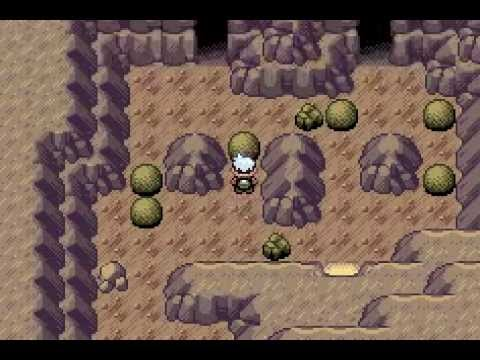

# Pokemon Maze (C++11)

Solves this kind of puzzle, by pushing rocks and finding the way through the maze. Mostly brute force.




## Compilation

```
mingw32-make
```
or

```
make
```

## Test

```
./test.sh
```

## Execution

It reads from `stdin` so you can do something like

```
boulder.exe < input.txt 
```

## Input

First two numbers are rows and columns.

X = wall
. = nothing
A = starting position
B = goal position
O = boulder

```
5 10
X X X X X X x x x x
X A O . . . X . . X
X X X . . O . B . X
X . . . X . . . . X
X X X X X X x x x x
```

## Output

```
→
→
↓
→
→
→
→
```

If it's unsolvable, it will print `no` to `stdout`.
